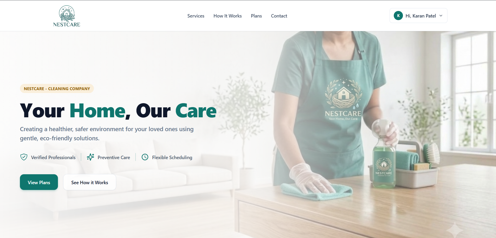
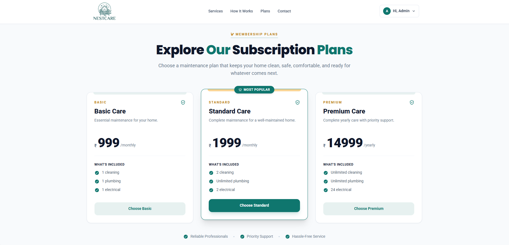
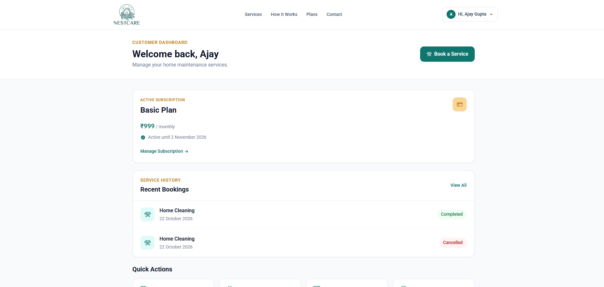
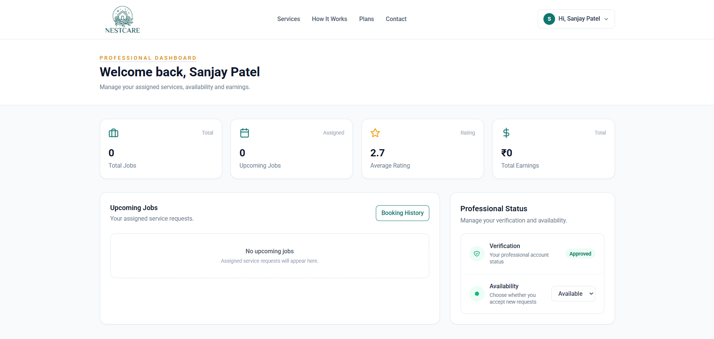
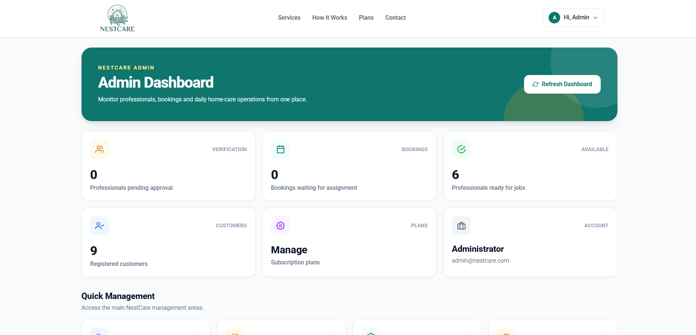
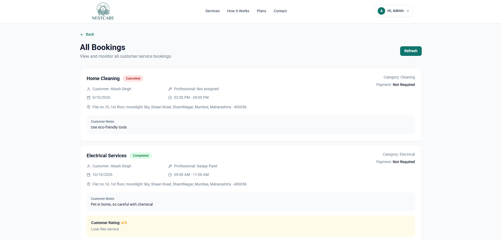
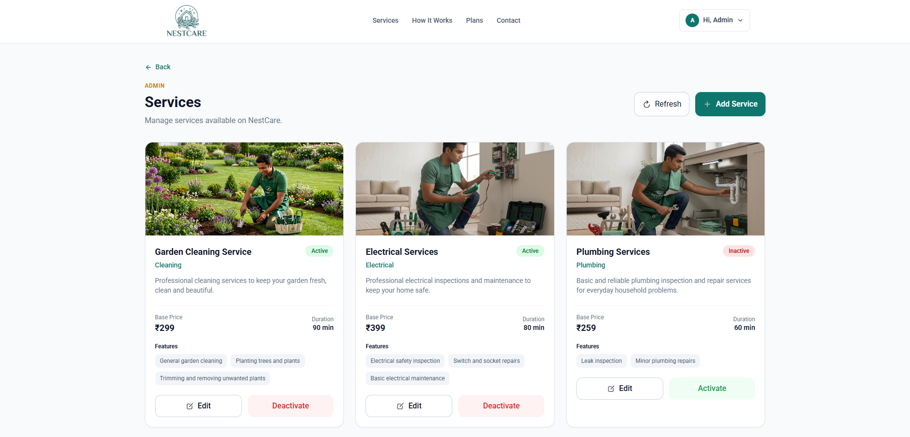

# NestCare – Subscription-Based Home Care Platform

NestCare is a subscription-based home care platform designed to make home maintenance easier, more organized, and convenient. It allows customers to purchase home care subscriptions, book services, track bookings, and receive professional assistance.

The platform provides separate interfaces for customers, service professionals, and administrators to manage the complete home care service workflow.

---

## Live Demo

**Live Application:** [Add Your Deployed Application URL]

**GitHub Repository:** [Add Your GitHub Repository URL]


## Table of Contents

* [About the Project](#about-the-project)
* [Live Demo](#live-demo)
* [Problem Statement](#problem-statement)
* [Project Objectives](#project-objectives)
* [Key Features](#key-features)
* [User Roles](#user-roles)
* [Application Workflow](#application-workflow)
* [Subscription System](#subscription-system)
* [Technology Stack](#technology-stack)
* [Project Structure](#project-structure)
* [Installation and Setup](#installation-and-setup)
* [Test Credentials](#test-credentials)
* [Environment Variables](#environment-variables)
* [Application Modules](#application-modules)
* [Booking Status](#booking-status)
* [Payment Integration](#payment-integration)
* [Security Features](#security-features)
* [Screenshots](#screenshots)
* [Future Enhancements](#future-enhancements)
* [Author](#author)
* [Acknowledgement](#acknowledgement)

---

## About the Project



NestCare is a full-stack web application developed to provide subscription-based home maintenance services through a centralized platform.

Instead of depending only on one-time home repair services, customers can choose a subscription plan according to their requirements. Based on the selected plan, customers can access included services and schedule maintenance appointments.

The platform connects customers, service professionals, and administrators through a structured booking and service management system.

NestCare supports three main user roles:

* **Customer:** Purchases subscriptions and books home maintenance services.
* **Professional:** Manages assigned bookings and provides services.
* **Admin:** Manages customers, professionals, services, subscriptions, bookings, and platform operations.

## Problem Statement

Home maintenance is often reactive. People usually search for cleaning, plumbing, or electrical services only when a problem occurs.

This approach can make regular maintenance difficult to organize and manage.

NestCare addresses this problem by providing a subscription-based platform where customers can access included home maintenance services, schedule appointments, and manage their service activities from one place.

## Project Objectives

* Develop a centralized home care service platform.
* Provide subscription-based home maintenance plans.
* Allow customers to book services included in their subscriptions.
* Connect customers with verified service professionals.
* Provide booking management and service tracking.
* Allow administrators to manage platform operations.
* Provide a structured system for customer feedback and dispute management.
* Create a responsive and user-friendly web application.

## Key Features

### Customer Features

* Customer registration and login.
* Browse available home maintenance services.
* View subscription plans and their benefits.
* Purchase subscription plans.
* Razorpay payment gateway integration (Test Mode).
* Book services included in an active subscription.
* View booking details and service history.
* Cancel eligible bookings.
* Submit ratings and reviews after service completion.
* Raise disputes for completed bookings.
* Track submitted disputes.
* Manage profile and address information.
* Change account password.
* View subscription details and expiry information.
* Receive subscription renewal reminders on the subscription management page.
* Subscribe to community updates.
* Contact the platform through the contact form.

### Professional Features

* Professional registration and login.
* Submit professional details and documents.
* View verification status.
* Manage availability status.
* View assigned bookings.
* Accept or reject assigned bookings.
* Start and complete assigned services.
* View completed booking history.
* Track earnings, ratings, and total jobs.

### Admin Features

* Admin authentication and dashboard.
* View customer information.
* View registered professionals.
* Approve or reject professional applications.
* Manage subscription plans.
* Activate or deactivate subscription plans.
* Manage home maintenance services.
* Create, update, and manage service information.
* View and manage customer bookings.
* Assign professionals to bookings.
* Manage customer disputes.
* Update dispute status and resolution details.
* View community subscriptions.
* View contact messages.
* Mark contact messages as read or new.
* View basic operational information through the dashboard.

---

## User Roles

| Role         | Responsibilities                                                                         |
| ------------ | ---------------------------------------------------------------------------------------- |
| Customer     | Manage subscriptions, book services, track bookings, submit reviews, and raise disputes. |
| Professional | Manage availability, handle assigned bookings, and complete services.                    |
| Admin        | Manage customers, professionals, subscriptions, services, bookings, and disputes.        |

## Application Workflow

The main application workflow is:

1. A customer registers or logs into the platform.
2. The customer explores available subscription plans.
3. The customer selects a suitable subscription plan and completes the payment through Razorpay Checkout.
4. The customer browses available services included in the subscription.
5. The customer books a service by selecting the required date and time slot.
6. The booking becomes available in the admin booking management section.
7. The admin assigns an approved professional to the booking.
8. The professional accepts the assigned booking.
9. The professional starts and completes the service.
10. The customer can submit a rating and review after completion.

## Subscription System

NestCare provides subscription plans that allow customers to access specific home maintenance services.

Each subscription plan contains:

* Plan name
* Description
* Billing cycle
* Price
* Included services
* Service quantities or unlimited service benefits
* Active or inactive status

### Supported Billing Cycles

* Monthly
* Quarterly
* Yearly

Customers can view their active subscription, subscription benefits, start date, and expiry date through the subscription management section.

Only services included in the customer's active subscription can be booked through the subscription booking workflow.

---

## Technology Stack

### Frontend

* **React.js** – Building the user interface.
* **JavaScript** – Application logic.
* **Tailwind CSS** – Responsive styling and UI design.
* **React Router DOM** – Client-side routing.
* **React Icons** – Icons and visual elements.
* **React Toastify** – Notifications and user feedback.

### Backend

* **Node.js** – JavaScript runtime environment.
* **Express.js** – Backend framework and REST API development.
* **MongoDB** – NoSQL database.
* **Mongoose** – MongoDB object modeling.
* **JSON Web Token (JWT)** – Authentication.
* **bcryptjs** – Password hashing.
* **Cookie Parser** – Cookie handling.
* **Multer** – File upload handling.
* **Cloudinary** – Image storage and management.

### Development Tools

* Visual Studio Code
* Git
* GitHub
* MongoDB Atlas / MongoDB
* Postman

---

## Project Structure

The project is organized into separate frontend and backend applications.

```text
NestCare/
│
├── client/
│   ├── public/
│   ├── src/
│   │   ├── assets/
│   │   ├── components/
│   │   ├── context/
│   │   ├── pages/
│   │   │   ├── admin/
│   │   │   ├── customer/
│   │   │   └── professional/
│   │   ├── App.jsx
│   │   └── main.jsx
│   ├── package.json
│   └── .env
│
├── server/
│   ├── config/
│   ├── controllers/
│   ├── middleware/
│   ├── models/
│   ├── routes/
│   ├── server.js
│   ├── package.json
│   └── .env
│
└── README.md
```

---

## Installation and Setup

Follow these steps to run NestCare locally.

### Prerequisites

Make sure the following are installed:

* Node.js
* npm
* MongoDB or MongoDB Atlas account
* Git
* Cloudinary account

### 1. Clone the Repository

```bash
git clone GITHUB_REPOSITORY_URL
```

Navigate to the project directory:

```bash
cd NestCare
```

### 2. Backend Setup

Navigate to the backend directory:

```bash
cd server
```

Install dependencies:

```bash
npm install
```

Create a `.env` file in the backend directory and configure the required environment variables.

```env
SERVER_PORT=YOUR_PORT
CLIENT_URL=YOUR_FRONTEND_URL
MONGO_URL=YOUR_MONGODB_CONNECTION_STRING
JWT_SECRET_KEY=YOUR_SECRET_KEY

CLOUDINARY_CLOUD_NAME=YOUR_CLOUD_NAME
CLOUDINARY_API_KEY=YOUR_CLOUDINARY_API_KEY
CLOUDINARY_API_SECRET=YOUR_CLOUDINARY_API_SECRET

ADMIN_EMAIL=YOUR_ADMIN_EMAIL
ADMIN_PASSWORD=YOUR_ADMIN_PASSWORD

#Secur Route
SERVER_FOR=CURRENT_PROJECT_STATUS (development or production)

#Razorpay credentials
RAZORPAY_API_KEY=YOUR_RAZORPAY_KEY_ID
RAZORPAY_API_SECRET=YOUR_RAZORPAY_KEY_SECRET
```

Run the backend server using the script configured in your backend `package.json`.

For example, if your project uses nodemon:

```bash
npm run dev
```

Or, if the start script is configured:

```bash
npm start
```

### 3. Frontend Setup

Open another terminal and navigate to the frontend directory:

```bash
cd client
```

Install dependencies:

```bash
npm install
```

Create a `.env` file in the frontend directory:

```env
VITE_SERVER_URL=YOUR_BACKEND_API_URL
```

Start the frontend development server:

```bash
npm run dev
```

The frontend will run at the local URL displayed in your terminal, usually:

```text
http://localhost:5173
```

---

## Environment Variables

### Backend Environment Variables

| Variable                | Description                                      |
| ----------------------- | -------------------------------------------------|
| `SERVER_PORT`           | Backend server port.                             |
| `CLIENT_URL`            | Frontend URL.                                    |
| `MONGO_URL`             | MongoDB connection string.                       |
| `JWT_SECRET_KEY`        | Secret key used for JWT authentication.          |
| `CLOUDINARY_CLOUD_NAME` | Cloudinary cloud name.                           |
| `CLOUDINARY_API_KEY`    | Cloudinary API key.                              |
| `CLOUDINARY_API_SECRET` | Cloudinary API secret.                           |
| `ADMIN_EMAIL`           | Admin email for signin                           |
| `ADMIN_PASSWORD`        | Admin password for signin.                       |
| `SERVER_FOR`            | Server status (development or production).       |
| `RAZORPAY_API_KEY`      | Razorpay API Key ID used for payment integration.|
| `RAZORPAY_API_SECRET`   | Secret key use for Razorpay payment verification.|

### Frontend Environment Variables

| Variable          | Description                                |
| ----------------- | ------------------------------------------ |
| `VITE_SERVER_URL` | Backend API base URL used by the frontend. |

---

## Test Credentials

The following test accounts can be used to access different user roles in NestCare.

| User Role    | Email                   | Password                   |
| ------------ | ----------------------- | -------------------------- |
| Customer     | raj@mail.com            | rajpass99                  |
| Professional | john@mail.com           | johnpass99                 |
| Admin        | admin@mail.com          | admin123                   |

**Note:** These credentials are provided for project demonstration and testing purposes only. Use dedicated test accounts and avoid sharing personal or production account credentials.


## Application Modules

### 1. Authentication Module

The authentication module handles user registration, login, logout, and protected access.

It supports separate authentication flows for customers, professionals, and administrators.

JWT-based authentication is used with HTTP-only cookies.

### 2. Customer Module

The customer module allows users to manage their accounts, subscriptions, service bookings, reviews, and disputes.

### 3. Professional Module

The professional module provides booking management, availability management, service completion, and performance information.

### 4. Admin Module

The admin module provides centralized management of customers, professionals, subscription plans, services, bookings, and disputes.

### 5. Subscription Module

The subscription module handles subscription plan listing, purchasing, active subscription management, and expiry handling.

### 6. Service Module

The service module manages home maintenance services across the supported categories:

* Cleaning
* Plumbing
* Electrical

Each service contains information such as its name, description, category, image, features, base price, and duration.

### 7. Booking Module

The booking module manages service requests, booking status updates, professional assignments, cancellations, and reviews.

### 8. Dispute Module

The dispute module allows customers to raise disputes related to completed bookings and allows administrators to review and update their status.

### 9. Contact Module

The contact module stores messages submitted through the contact form and allows administrators to view and manage them.

### 10. Community Module

The community module allows visitors to subscribe to platform updates using their email addresses.

---

## Booking Status

The booking system supports the following statuses:

| Status        | Description                                            |
| ------------- | ------------------------------------------------------ |
| `proposed`    | Booking has been created and is awaiting admin action. |
| `confirmed`   | Booking has been confirmed.                            |
| `assigned`    | A professional has been assigned to the booking.       |
| `accepted`    | The assigned professional has accepted the booking.    |
| `in-progress` | The professional has started the service.              |
| `completed`   | The service has been completed.                        |
| `cancelled`   | The booking has been cancelled.                        |
| `rescheduled` | The booking has been rescheduled.                      |

---

## Payment Integration

NestCare uses Razorpay as its payment gateway for handling subscription payments.

When a customer selects a subscription plan, the application creates a payment order through the Razorpay integration. The customer then completes the payment using the Razorpay Checkout interface.

After the payment is completed, the backend verifies the payment details and signature. If the verification is successful, the payment record is stored in MongoDB and the customer's subscription is activated.

The payment integration includes:

* Razorpay Checkout integration.
* Payment order creation.
* Backend payment signature verification.
* Payment record management.
* Subscription activation after successful payment.
* Handling of failed payment scenarios.

**Note:** Razorpay Test Mode is currently used for testing. Test transactions do not involve real money. Live payments require Razorpay Live Mode configuration.


---

## Security Features

The application includes the following security-related implementations:

* Password hashing using bcryptjs.
* JWT-based authentication.
* HTTP-only authentication cookies.
* Protected routes and role-based access control.
* Separate customer, professional, and admin access.
* Backend validation for important operations.
* Environment variables for sensitive configuration.
* Controlled access to administrative operations.

---

## Screenshots

### Home Page

### Subscription Plans

### Customer Dashboard

### Professional Dashboard 

### Admin Dashboard

### Booking Management

### Service Management



---

## Future Enhancements

The following features can be considered for future development:

* Email or phone OTP verification
* Enable Razorpay Live Mode for processing real payments.
* Automated email and SMS notifications.
* Online appointment reminders.
* Advanced analytics and reporting.
* Live booking status notifications.
* Customer support chat.
* Automated subscription renewal payments.
* Advanced service scheduling and maintenance tracking.

---

## Author

#### **Rajkumar Gupta**
(Full Stack Developer)

<br/>Github Link: https://github.com/iamraj333
<br/>LinkedIn Link: https://www.linkedin.com/in/guptarajkumar
<br/>Portfolio Link: https://www.rajcraft.online

Project: NestCare – Subscription-Based Home Care Platform
